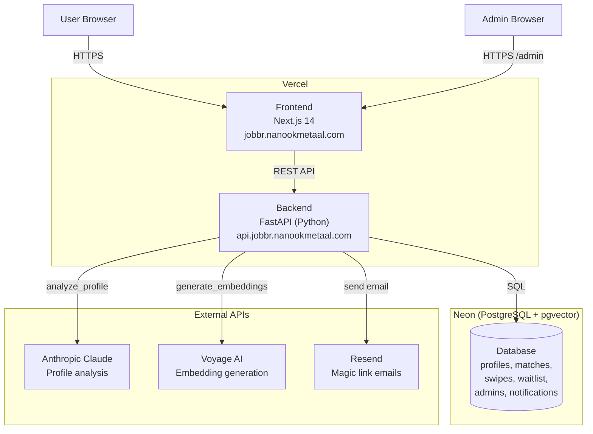
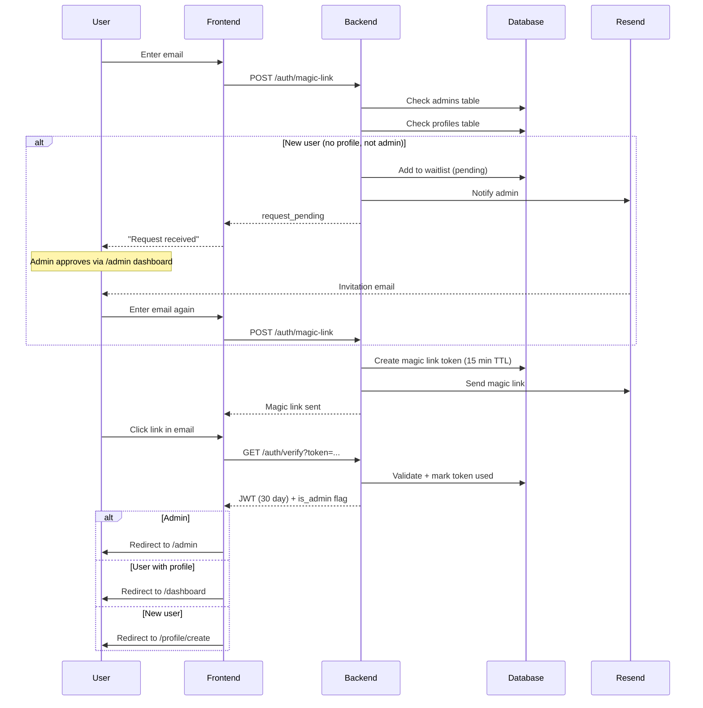
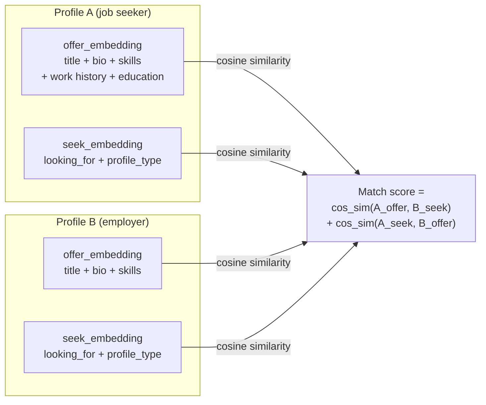
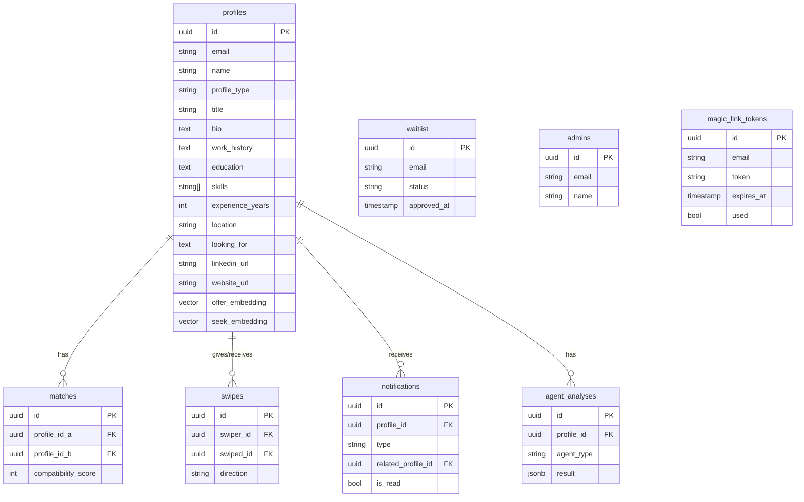

# Jobbr

A professional matching platform - think Tinder for jobs and mentorship. Create a profile as a job seeker, employer, mentor, or mentee, and get matched with complementary people based on what you offer and what you're looking for.

## Features

- Invite-only access with admin approval flow
- Passwordless sign-in via magic link (email)
- Profile creation and editing (job seeker, employer, mentor, mentee)
- Profile analysis - completeness score, strengths, gaps, and improvement tips
- Smart matching using vector embeddings (Voyage AI) - finds complementary profiles, not just similar ones
- Swipe left/right on matches
- Mutual match detection with coffee invite notification
- Admin dashboard for managing profiles and approving waitlist requests

## Architecture

### System overview



### Authentication flow



### Matching algorithm



Profiles are embedded as two vectors - what they **offer** and what they **seek**. Match score rewards complementary pairs (job seeker + employer) rather than similar ones.

### Database schema



## Tech stack

| Layer | Tech |
|---|---|
| Frontend | Next.js 14 (App Router), TypeScript, Tailwind CSS |
| Backend | Python, FastAPI, SQLAlchemy (async), asyncpg |
| Database | PostgreSQL + pgvector (Neon) |
| Embeddings | Voyage AI (`voyage-3`, 1024 dimensions) |
| AI analysis | LangChain + Anthropic Claude |
| Email | Resend |
| Hosting | Vercel (frontend + backend as serverless functions) |

## Running locally

### Prerequisites

- Python 3.11-3.13 with [uv](https://docs.astral.sh/uv/)
- Node.js 18+
- PostgreSQL with pgvector (`brew install pgvector` on macOS)

### 1. Database

```bash
brew services start postgresql@17

psql postgres -c "CREATE USER jobbr WITH PASSWORD 'jobbr';"
psql postgres -c "CREATE DATABASE jobbr OWNER jobbr;"
psql -d jobbr -c "CREATE EXTENSION IF NOT EXISTS vector;"
```

### 2. Backend

```bash
cd backend
cp .env.example .env
# Edit .env and fill in your API keys

uv sync
uv run uvicorn app.main:app --reload --port 8000
```

API docs available at http://localhost:8000/docs.

### 3. Frontend

```bash
cd frontend
npm install
npm run dev
```

Open http://localhost:3000.

## Environment variables

Copy `backend/.env.example` to `backend/.env` and fill in all values:

| Variable | Where to get it |
|---|---|
| `DATABASE_URL` | Use the default for local setup |
| `ANTHROPIC_API_KEY` | https://console.anthropic.com |
| `VOYAGE_API_KEY` | https://dash.voyageai.com |
| `RESEND_API_KEY` | https://resend.com |
| `EMAIL_FROM` | A sender address on a domain verified in Resend |
| `JWT_SECRET` | Any random string (`openssl rand -hex 32`) |
| `ADMIN_SECRET` | Any random string (`openssl rand -hex 20`) |
| `ADMIN_EMAIL` | Email address that receives access request notifications |
| `FRONTEND_URL` | `http://localhost:3000` for local dev |

## Deploying to Vercel

See [CLAUDE.md](CLAUDE.md) for full step-by-step deployment instructions, including how to set up the Neon database, configure env vars, and add the first admin.

## Using Claude Code?

See [CLAUDE.md](CLAUDE.md) for a detailed guide covering architecture, key decisions, and development workflows.
